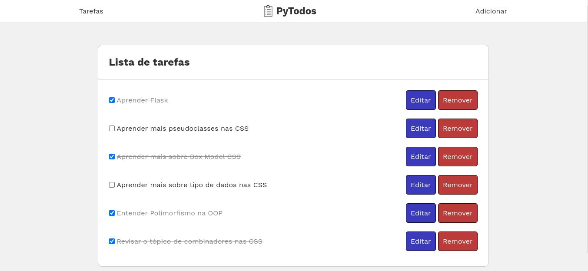
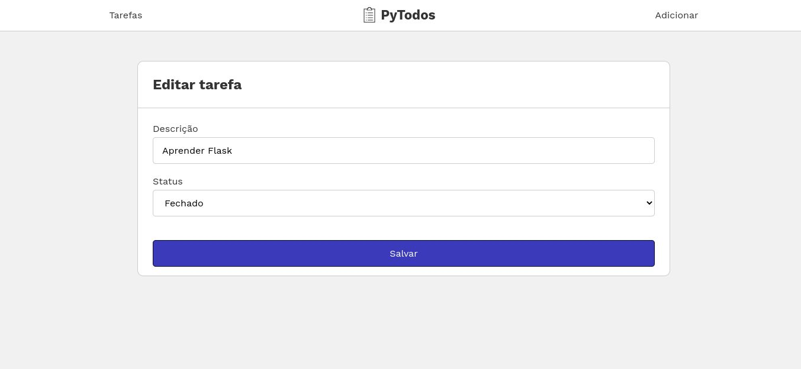

# py-todos
Gerenciador de tarefas feito em Python para aprender Flask.

## Instalação
Para instalar, execute:
```bash
$ git clone https://github.com/criskell/py-todos # Clonar o repositório
$ cd py-todos
$ python3.10 -m venv venv # Criar o ambiente virtual no diretório "venv"
$ source venv/bin/activate # Ativar o ambiente virtual no diretório "venv"
$ pip install -r requirements.txt # Instala os requisitos
$ export FLASK_ENV=development # Habilita todas as funcionalidades de desenvolvimento do Flask
$ flask run # Inicia o Flask
```
Agora para acessar o site, com o servidor iniciado, [clique aqui](http://127.0.0.1:5000/).

## Screenshots

